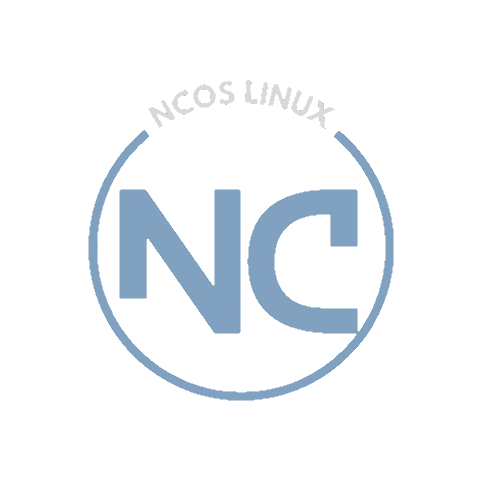

# Welcome to the NCOS Wiki

## Get Started
Whether you're a new user or a seasoned developer, this documentation will guide you through every aspect of NCOS. Here's what you can find:
 
- [Installation Guide](Pre-Install.md): Step-by-step instructions to install NCOS.
- [Getting Started](shortcuts.md): Learn the basics

## Contribute to NCOS
NCOS is a community-driven project, and your contributions are welcome! Whether you're reporting a bug, submitting a patch, or improving this documentation, every bit helps.

Visit our [GitHub repository](https://github.com/exothermic88/NCOS) to get involved.

---

📘 **Tip:** Use the search bar at the top to quickly find topics of interest.
